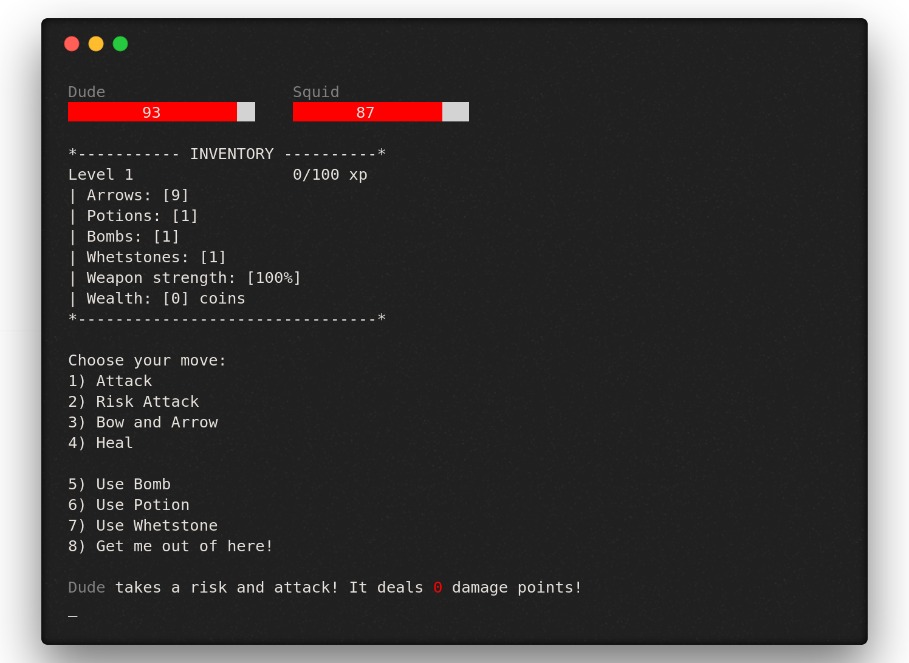
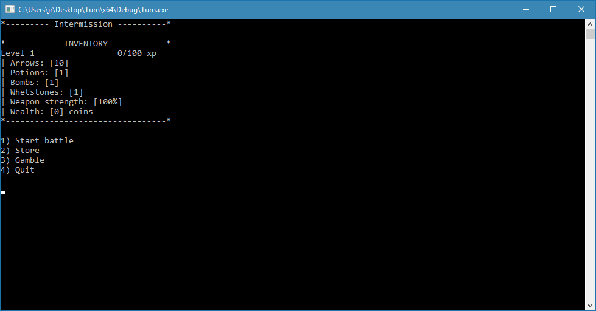

# Turn [](https://travis-ci.org/tagniam/Turn)
Turn is a basic turn-based RPG game written in C++. 

## History
I wrote this game almost 5 years ago, and uploading it to GitHub was my first experience with open source. During [Hacktoberfest 2017](https://hacktoberfest.digitalocean.com/), I wanted to give back to the community and encouraged everyone, regardless of programming skills, to contribute. Thank you to all the amazing contributors and see you next year!

## Screenshots




## GIFs

## How To Play
See the [wiki](https://github.com/tagniam/Turn/wiki) for instructions.

## Getting Started
### Prerequisites
* [CMake](https://cmake.org) is used to generate project files across different platforms.
* Linux users: for audio, SDL_mixer is used. Simply install the SDL2 mixer dev packages on your distro of choice before building (for example on Ubuntu run `sudo apt-get install libsdl2-dev libsdl2-mixer-dev`)

### Building
#### Windows
* To build project files with CMake, simply run [CMake](https://cmake.org/) on the root CMakeLists.txt. `CMake-gui` is recommended for an easy way to select project options.

#### Linux & Mac
```shell
$ git clone https://github.com/tagniam/Turn.git
$ cd Turn/
$ ./configure
$ cd build/
$ make
```

Make sure you run the executable from the `Turn` directory so the in-game sounds can work:
```shell
$ ./build/Turn  # play the game!
```

## Contributing
* Before working on an issue, make sure you comment on it to claim it. This prevents two people working on the same issue at the same time.

## License
* This project is licensed under the MIT License - see the LICENSE file for details.

